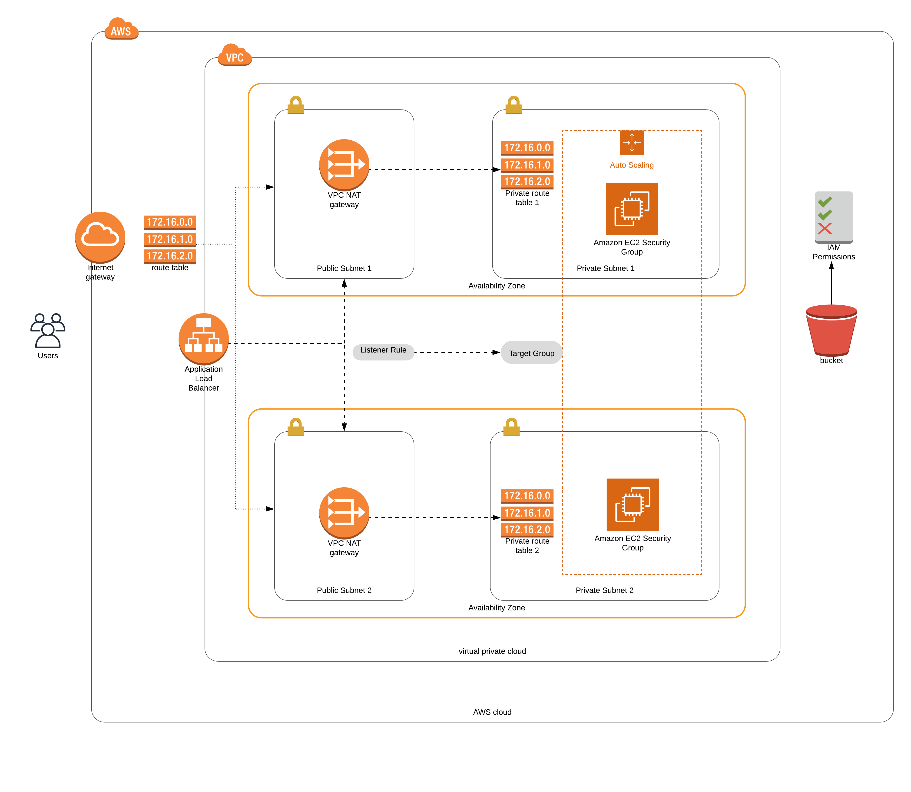

# Project 2 - Deploy a High Availability Web App with CloudFormation

### Diagram for the cloud infrastructure meeting requirements



```sh
In this first project, I deployed web servers for a highly available web app using CloudFormation. I wrote the code that creates and deploys the infrastructure and application for an Instagram-like app from the ground up. First I deployed the networking components, followed by servers, security roles and software.
```

## The files included are:

```sh
* /images : Diagram of the infrastructure and screenshots of the steps followed in this project.
* /udagram-app : index.html file of a static web page to confirm the deployment was successfull.
* create delete and update .sh files : helpers for creating, updating and deleting the stack in CloudFormation.
* network-server.yml : yaml file with the components for deploying the network and servers in CloudFormation
* network-server.json : Helper file for parameters to refer in the yaml file.
```